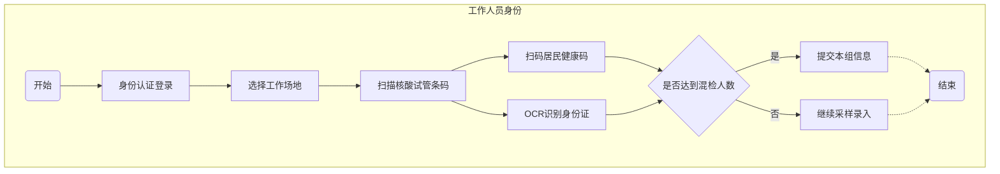
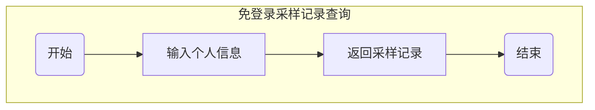
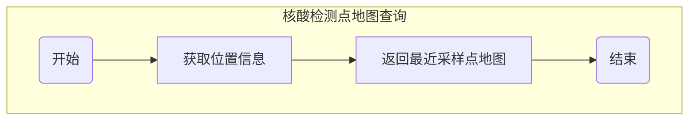
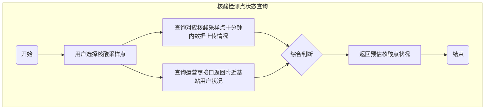
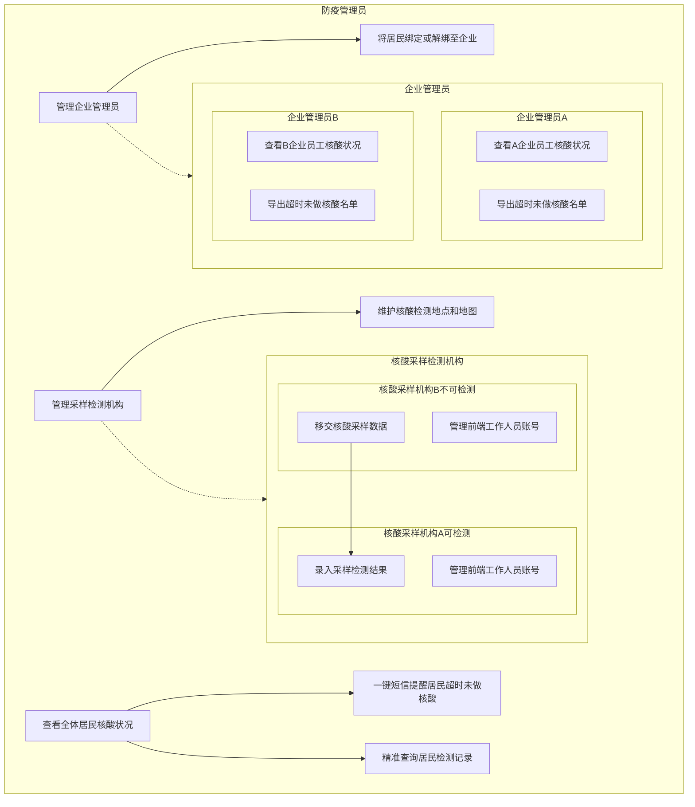

# 常态化疫情阶段核酸检测管理系统

## 项目背景
自2022年以来，应常态化防疫工作的需要，A市根据防疫形式每周进行1-2次的全民核酸。奥密克戎等变异株传播速度较快，给A市带来了多轮局部散点疫情，每轮疫情均需要在短时间内进行全民核酸检测，而A市核酸检测系统在2020年2月临时上线后便无更新，已经不能满足现有的防疫需求。

原来的全民核酸检测系统使用传统网页，通过输入身份证号和扫描核酸检测试管号录入后端数据库，整体流程稍显麻烦，系统吞吐量和并发用户数有限。后端管理系统只能查看到身份证号和核酸检测试管号，核酸检测中心只能根据核酸检测试管号获得对应人员身份证号，并定期手动上传至X省健康云服务系统，核酸检测上传结果存在较严重滞后问题。
## 需求分析
本项目为A市委托本公司开发，主要包含前端（小程序端）和后端（Web端）。

### 前端（微信小程序）
不再采用普通居民和工作人员的双角色账号，小程序仅提供工作人员登录和免登录采样记录查询两种功能，并会在后期上线核酸检测点地图查询和核酸检测点状况查询的功能。

普通居民展示X省健康码即可进行核酸检测，工作人员扫码采样人员健康码后系统从X省健康云系统快速获得居民信息并传回前端，采样人员核对居民身份信息并绑定核酸检测试管编号。

在达到核酸检测试管单管最大人数后，系统会弹出提醒工作人员达到混检比例，工作人员提交后系统会自动上传至X省健康云系统。应目前X省健康云系统承载能力有限，核酸采样记录上传约1小时后X省健康码后会显示采样记录。

为了照顾急需核酸采样记录的居民或旅客，自核酸采样后24小时后，居民可在微信小程序中免登录根据身份证号和姓名查询核酸采样记录，以免耽误居民的正常出行和生活。除X省健康云系统出现故障等特殊情形外，本系统可查询的核酸采样记录仅为最近24小时内的数据。

为了照顾老年人和青少年等无手机人士或不方便使用手机的人士，本系统在工作人员端集成了身份证照片快速OCR识别的功能，老年人和青少年只需要出示身份证即可快速完成采样登记。除此之外，X省健康码也推出了“亲属代出示”的功能，工作人员也可扫描随行家人的“家属健康码”完成采样登记。

前端功能大致流程如下：

### 后端（Web系统）
后端主要分为以下几种角色：防疫管理员（卫健委）、企业管理员（防疫办）、核酸检测机构/核酸采样机构
#### 防疫管理员（卫健委）
系统的全部权限，包括但不限于以下权限：
* 根据身份证等信息查询居民核酸检测记录
* 管理所属辖区的居民和正在合作的核酸检测机构（核酸采样机构）
* 管理所属辖区的企业账号，并将居民绑定或解绑至企业
* 管理所属辖区的核酸检测地点，维护核酸检测点地图

#### 企业管理员（防疫办）
管理绑定至当前企业的居民，主要包括以下权限：
* 查看企业员工的核酸检测记录
* 生成距上次核酸检测超过指定时限的人员名单

#### 核酸检测机构/核酸采样机构
* 录入本机构采样的核酸试管条码的检测结果
* 管理本机构前端工作人员的账号，可查看每个账号近期工作动态
* 若采样机构和检测机构不是同一个，采样机构可以将数据移交其他检测机构账号

后端功能大致架构如下：

## 技术架构
**前端：** 采用Vue+ElementUI+VantUI

**后端：** 采用SpringBoot+SpringSecurity+Mybatis+MySQL

## 开发团队
因本次系统开发周期约为1-2个月，以下岗位均以月薪（12薪）计算人力成本。不考虑办公场地和硬件成本。

以下岗位均包含五险一金（每人每月公司成本按2000元计算），工作地点：**深圳市南山区粤海街道科兴科学园** （参考办公场地成本120平方米，参考办公场地费用2.5万/月）
|岗位 | 人数 | 薪资 | 岗位要求 | 工作职责
| --- | --- | --- | --- | --- |
| 项目经理 | 1 | 15-30k/月 | 3年及以上IT工作经验，有企业端或者政务端项目全流程经验。五官端正气质佳，善长沟通与协调，有相关合同签约经历。|负责与甲方进行沟通，推进整体开发进度，确保按时按质完成项目上线。|
| 产品经理 | 1 | 13-25k/月 | 3年及以上IT工作经验，1年及以上一线开发经验。对于政府信息化、大数据应用、大中型企业ERP等至少两类项目实施或相关背景项目管理实施经验 | 负责调研整个项目各端的实际需求，负责分析其他地市同类产品的优劣；带领整个项目开发组，掌控项目整体进度。针对实际开发过程或实际运维过程中的问题，能够提出一些有创新性的解决方案。
| UI设计师 | 1 | 10-20k/月 | 美术相关专业毕业，有5年以上设计经验。具有出色的艺术设计能力和审美观点，能够感知各年龄段用户的审美感受，能够将简洁易懂的思维带到产品界面设计中。| 负责系统开发前后端的各种交互界面、图标、LOGO、按钮等相关元素的设计与制作，积极与开发沟通推进界面与交互设计的最终实现。
| 前端开发工程师 | 1 | 11-20k/月 | 计算机科学与技术、软件工程相关专业毕业生，有相关经验者优先，精通Vue、React、JS等前端框架，使用过ElementUI、VantUI等前端组件，抗压力强。 | 负责小程序的前端开发工作与维护，配合后端完成接口设计，配合UI设计师完成前端的整体设计，参与软件设计研发、上线评估、后期运维讨论。
| 后端开发工程师 | 1 | 11-20k/月 | 计算机科学与技术、软件工程相关专业毕业生，精通JAVA，了解SpringBoot、SpringSecurity、Mybatis等框架，了解MySql数据库，能较好地阅读各类接口文档，有相关开发经验者优先，抗压力强。 | 负责Web管理后端的开发，负责后端数据库MySql的设计。确保系统架构设计合理，确保系统的稳定性和安全性。配合前端完成整体程序的设计，配合服务端开发工程师确保系统的稳定并持续进行优化，能将系统对接至各类上下级系统，参与软件设计研发、上线评估、后期运维讨论。
| 服务器端开发工程师 | 1 | 15-25k/月 | 计算机科学与技术、软件工程、数据科学与大数据技术等相关专业毕业生，有3年以上服务器运维经验，有后端开发尤其是数据库设计经验，精通高并发系统设计，抗压力强。 | 配合后端工程师合理高效地设计数据库面对较高地系统吞吐量与用户并发数，及时处理各类服务器资源不足的问题。分析和监控服务器运营状况，确保服务器可扩展性和稳定运行，参与软件设计研发、上线评估、后期运维讨论。
| 测试工程师 | 1 | 10-15k/月 | 计算机、通信相关专业，有测试或开发工作经验，工作细心且耐心，能较好地与他人进行沟通，抗压力强。 | 根据软件社区需求进行测试，按时按量提交前后端测试报告，准确定位问题并提出合理建议，参与软件设计研发、上线评估讨论。
| 运维工程师 | 1 | 10-15k/月 | 计算机、通信相关专业，精通Shell脚本语言，3年以上运维工作经验。懂硬件与安全，有网络攻防实战经验者优先，抗压力强。| 对服务器进行日常维护，确保网站和小程序正常运行。配合服务器端开发工程师和后端开发工程师反馈系统运行状况并提出合理建议，根据系统需求制定运维技术方案，参与软件上线评估、后期运维讨论。

**总结：** 经过分析，本次系统开发人力成本约为11-15w元/月，五险一金成本约为2w元/月。若考虑办公场地及其他零星开支，每月成本约为17-20w元/月。（不包含服务器等硬件费用）

## 开发计划
应A市市政府对于系统稳定性的要求和新系统上线的紧迫性，本系统采用敏捷开发模式，分阶段开发上线。

### 第一阶段（基础框架）
本阶段主要上线前端工作人员登录功能、后端的数据移交、结果录入、结果查询等基础功能，经各类测试后上线运行。试运行期间观察并发性能，此时A市核酸检测旧系统仍然保持运行，此阶段耗时约为28-40天。
#### 1.1 需求分析与需求定义
本阶段主要完成以下工作，耗时约3-5天。
* 签订合同
* 提供基础方案至甲方
* 确认甲方需求并作分析
* 甲方审核后作出最终需求文档
 
#### 1.2 接口申请
本阶段主要是与甲方一起向X省健康云管理方申请接口，以实现居民个人信息的回传与核酸采样记录、核酸检测结果的实时上报，了解清楚接口文档有利于后续开发的顺利推进，此过程可延续至“1.3 软件设计”阶段结束，耗时约3-7天。

除此之外，在软件开发过程中，可能要使用到如身份证OCR识别接口、地图标签定制化接口等，各类接口的申请与使用仍需在此阶段与甲方根据合同做好协商工作，以便于后期系统各功能的正常运行。

 #### 1.3 软件设计
 本阶段主要进行概要设计与详细设计，此过程中的设计不仅要照顾第一阶段的开发需要，还要兼顾第二阶段的开发需要，耗时约3-5天。
 * 明确系统中各业务的流程图
 * 讨论使用何种前后端技术
 * 讨论前后端UI交互方式
 * 对模块进行合理划分
 * 对数据库进行设计
 * 对接口进行合理划分

#### 1.4 设计评审
本阶段主要对上一阶段的设计进行评审并历经N轮改进后确定设计方案。考虑到核酸检测系统需要面对高并发的问题，除常规软件设计评审外还需对软件高效性提出更高要求，耗时约2-3天。

#### 1.5 代码开发
本阶段主要开发前端（微信小程序）和后端（Web界面）的核心功能，因微信小程序具有跨平台的特性，开发过程中无需分为IOS和Android进行开发，但因前端微信小程序还需通过腾讯公司审核，前端开发进度需略快于后端，耗时约7-10天。
* 对前端工作人员界面进行开发
* 对后端核酸检测采样机构角色的前端工作人员账号管理功能进行开发
* 对后端核酸检测采样机构角色的移交核酸采样数据功能进行开发
* 对后端核酸检测采样机构角色的居民核酸检测结果录入进行开发
* 对后端防疫管理员角色的核酸检测结果查看、精准查询检测记录功能进行开发

#### 1.6 单元测试与代码评审
本阶段主要对各模块如前端工作模块、结果录入模块、精准查询模块进行单元测试，并对代码进行交叉阅读来检查源代码是否符合编程标准，并在此阶段提高代码质量，剔除冗余代码，提高系统效率，耗时约2-3天。

#### 1.7 系统集成测试
本阶段主要通过前端后端全流程模拟来实现系统测试，保证各模块之间数据传输正常且能相互协调工作，确保系统的健壮性与可靠性，为用户测试、上线测试做好准备工作，耗时约2-3天。

#### 1.8 用户测试与上线测试
本阶段主要先通过小范围用户测试查看系统运行情况，后在A市部分区域上线测试使用新系统查看系统运行情况，及时处理测试过程中出现的问题，避免对防疫工作造成更大影响，耗时约3-4天。

#### 1.9 软件交付与用户培训
本阶段主要根据合同内容向甲方交付前后端源代码、数据库数据字典、《用户安装手册》、《用户使用指南》、需求报告、设计报告、测试报告等，并组织对部分卫健委工作人员、采样检测机构工作人员的现场培训，耗时约1-2天。

### 第二阶段（扩展功能）
本阶段主要完成前后端全部功能，经部分用户灰度测试后上线运行，不断完善系统的并发性能，确保能承载A市紧急全民核酸检测的系统吞吐量与并发用户数，并逐步停用A市核酸检测旧系统，此阶段耗时约15-25天。
#### 2.1 软件设计与设计评审
本阶段主要根据第一阶段软件设计过程中预留的接口等进行二次开发的设计讨论，确定各扩展功能对现有系统稳定性的影响，提高各扩展功能的易用性与实用性。根据上一阶段系统并发性能的观察结果，对系统数据库等作出合理优化，同时设计接口逐步导入A市核酸检测旧系统的数据，耗时约2-3天

#### 2.2 代码开发
本阶段主要开发前端（微信小程序）和后端（Web界面）的扩展功能，因微信小程序和Web界面具有无需升级、即开即用的特性，现有的各用户终端在开发完成上线后即可直接使用新功能，无需像APP一样等待用户手动升级，耗时约7-10天。
* 对前端的免登录采样记录查询、核酸检测点地图查询、核酸检测点状态查询进行开发
* 为后端新增企业管理员模块角色，企业可查看本企业员工的核酸状况
* 对后端防疫管理员角色的企业管理员管理功能进行开发
* 对后端防疫管理员角色的核酸检测地点、核酸检测地图的管理功能进行开发
* 对后端防疫管理员角色的居民绑定解绑企业功能进行开发
* 对后端核酸检测采样机构角色的前端工作动态查看功能进行开发
* 设计接口导入A市核酸检测旧系统数据库中的核酸检测数据。
* 提高系统的并发性能，确保系统在核酸检测高峰期也能稳定运行。

#### 2.3 单元测试与代码评审
本阶段主要对各新增模块如企业管理模块、前端工作动态模块进行单元测试，并对代码进行交叉阅读来检查源代码是否符合编程标准，并在此阶段提高代码质量，剔除冗余代码，提高系统效率，耗时约2-3天。

#### 2.4 系统集成测试
本阶段主要通过前端后端全流程模拟来实现系统测试，保证各模块之间数据传输正常且能相互协调工作，确保系统的健壮性与可靠性，为用户测试、上线测试做好准备工作，耗时约2-3天。

#### 2.5 用户测试与上线测试
本阶段主要先通过小范围用户测试查看新增功能后系统运行情况，后在A市选取部分用户灰度测试使用新系统查看系统运行情况，及时处理测试过程中出现的问题，避免对防疫工作造成更大影响，耗时约3-4天。

#### 2.6 软件交付与用户培训
本阶段主要根据合同内容向甲方交付前后端源代码、数据库数据字典、《用户安装手册》、《用户使用指南》、需求报告、设计报告、测试报告等，并组织对部分卫健委工作人员、企业防疫工作人员、核酸检测采样机构管理部门的现场培训，耗时约1-2天。

### 第三阶段（运维阶段）
根据合同内容，对系统和服务器进行后期运维，确保核酸检测高峰期系统仍能正常运行，确保核酸检测系统数据安全。若A市人口长期持续增加，应根据合同内容或与甲方协商及时对服务器进行扩容以满足更多用户的需要。

# 项目报价
经本公司管理层综合考虑，经韩梅梅、李雷等管理层批准，本系统对A市市政府报价价格为50万元人民币，不包含各类第三方公司提供的接口收费和服务器费用。
