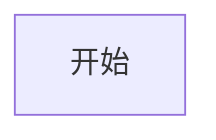

# 常态化疫情阶段核酸检测管理系统

## 项目背景
自2022年以来，应常态化防疫工作的需要，A市根据防疫形式每周进行1-2次的全民核酸。奥密克戎等变异株传播速度较快，给A市带来了多轮局部散点疫情，每轮疫情均需要在短时间内进行全民核酸检测，而A市核酸检测系统在2020年2月临时上线后便无更新，已经不能满足现有的防疫需求。

原来的全民核酸检测系统使用传统网页，通过输入身份证号和扫描核酸检测试管号录入后端数据库，整体流程稍显麻烦，系统吞吐量和并发用户数有限。后端管理系统只能查看到身份证号和核酸检测试管号，核酸检测中心只能根据核酸检测试管号获得对应人员身份证号，并定期手动上传至X省健康云服务系统，核酸检测上传结果存在较严重滞后问题。
## 需求分析
本项目为A市委托本公司开发，主要包含前端（小程序端）和后端（Web端）。

### 前端
不再采用普通居民和工作人员的双角色账号，仅提供工作人员登录和免登录采样记录查询两种功能。

普通居民展示X省健康码即可进行核酸检测，工作人员扫码采样人员健康码后系统从X省健康云系统快速获得居民信息并传回前端，采样人员核对居民身份信息并绑定核酸检测试管编号。

在达到核酸检测试管单管最大人数后，系统会弹出提醒工作人员达到混检比例，工作人员提交后系统会自动上传至X省健康云系统。应目前X省健康云系统承载能力有限，检测

## 技术架构

