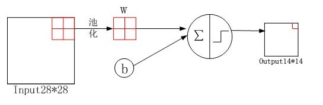

# 第六次作业：使用PyTorch实现LeNet-5网络进行MNIST手写数字识别的深度学习实践

Teacher：张书妍

## 作业内容

查阅资料, 选择一种使用卷积神经网络的计算机视觉领域的应用, 根据深度学习模型训练的步骤, 分析每一个步骤的具体内容(步骤5、6合并, 步骤7可省) 


### 作业背景

**本次作业为《计算思维与计算机素养》课程第6次课程（张书妍老师）的作业。** 本次作业选择的计算机视觉领域卷积神经网络应用为“基于LeNet-5网络改进的MNIST手写数字识别”。

之所以选择这个方向，是因为李国和老师往年在《计算思维与计算机素养》课程上提过相关内容，因此在2021年暑期短学期与2021级的同学交流的过程中了解到了一些实现手写字识别的算法思想，也一直期望能有机会自行实现一次手写字识别，这次作业也刚好是天赐良机，因此就有了这份作业。

### 算法介绍
LeNet-5为LeCun等人在1988年提出的一种非常高效的卷积神经网络，其在当时效果与机器学习领域的支持向量机不相伯仲。深度学习领域经过近30年的发展，衍生出了许多现代神经卷积神经网络，如：
* AlexNet。它是第⼀个在⼤规模视觉竞赛中击败传统计算机视觉模型的⼤型神经⽹络
* 使⽤重复块的⽹络（VGG）。它利⽤许多重复的神经⽹络块；
* ⽹络中的⽹络（NiN）。它重复使⽤由卷积层和1 × 1卷积层（⽤来代替全连接层）来构建深层⽹络;
* 含并⾏连结的⽹络（GoogLeNet）。它使⽤并⾏连结的⽹络，通过不同窗口⼤⼩的卷积层和最⼤汇聚层
来并⾏抽取信息；
* 残差⽹络（ResNet）。它通过残差块构建跨层的数据通道，是计算机视觉中最流⾏的体系架构；
* 稠密连接⽹络（DenseNet）。它的计算成本很⾼，但给我们带来了更好的效果。
  
LeNet-5与如今深度学习模型已有较大区别，因此对LeNet进行了些许修改，并在Anaconda虚拟环境下使用Pycharm进行了实现，主要修改内容如下：
1. 激活函数：采用主流的Relu代替sigmoid，从而解决梯度消失的问题
2. 池化层：采用Max-pooling（最大池化层）代替Average-pooling（平均池化层）从而提高识别准确率
3. 输出层采用Softmax代替Gaussian Connections。

## 作业内容

### 1.1 问题定义

本次实践致力于通过机器学习算法实现对手写数字的识别，训练过程使用的深度学习模型为改进的LeNet-5，这是1988年提出的一种非常高效的卷积神经网络，其可靠性已经得到行业和时长的验证，成为监督学习的主流⽅法。LeNet至今仍被⼴泛⽤于⾃动取款机（ATM）机中，帮助识别处理⽀票的数字。训练过程主要使用美国国家标准与技术研究所制作的MNIST，MNIST是一个非常有名的手写体数字识别数据集。训练样本：共60000个，其中55000个用于训练，另外5000个用于验证；测试样本：共10000个。MNIST数据集每张图片是单通道的，大小为28x28。通过多次完成前向计算 + 反向传播的过程，实现不断降低误差和提高准确度的目的，从而实现高准确度、低误差的手写字识别，继而实现诸如“字符分割+手写识别->手写算式识别”的应用。


### 1.2 确定评估标准

通过经过每一轮前向计算+反向传播完成后的误差（Loss）和准确度（Accuracy），此处使用的损失函数为交叉熵损失函数，准确度函数为验证集中根据现有模型预测值与标签值相等的比例。根据每轮计算的数据分别作出误差-训练次数/准确度-训练次数的折线图。

### 1.3 确定Baseline和Target
Baseline：使用原始的LeNet模型，容易出现过拟合等问题， 经过多轮测试平均准确度（accuracy）约为92%左右，平均损失函数（loss）约为0.04。

Target：预期通过五轮左右的深度学习，使用标准化数据的改进后的LeNet预测准确度（accuary）达到97%以上，损失函数（Loss）低于0.02。

### 1.4 模型训练
由于MINIST数据集图片尺寸是 $28*28$ 单通道的，而LeNet-5网络输入 Input 图片尺寸为 $32*32$ ，因此首先使用`transform.Resize`将图片尺寸进行调整。

因神经网络模型偏爱标准化数据，加之原始数据不仅分布不均（噪声大）而且数值通常都很大，因此对样本数据减去其均值，再除以它的标准差，将样本数据呈现为均值0、方差1的数据分析，这也有利于加快神经网络的训练。根据数据集提供方的标准化参数0.01307/0.03081使用`transforms.Normalize`对数据进行标准化处理。


根据传统的LeNet-5网络进行如下优化，自定义继承于nn.Module的网络结构，并定义前向传播的过程：
```python
class LeNet(nn.Module):
    def __init__(self):
        super(LeNet, self).__init__()
        self.conv1 = nn.Conv2d(1, 6, 5)
        self.relu = nn.ReLU()
        self.maxpool1 = nn.MaxPool2d(2, 2)
        self.conv2 = nn.Conv2d(6, 16, 5)
        self.maxpool2 = nn.MaxPool2d(2, 2)
        self.fc1 = nn.Linear(16 * 5 * 5, 120)
        self.fc2 = nn.Linear(120, 84)
        self.fc3 = nn.Linear(84, 10)

    def forward(self, x):
        x = self.conv1(x)
        x = self.relu(x)
        x = self.maxpool1(x)
        x = self.conv2(x)
        x = self.maxpool2(x)
        x = x.view(-1, 16 * 5 * 5)
        x = F.relu(self.fc1(x))
        x = F.relu(self.fc2(x))
        x = self.fc3(x)
        output = F.log_softmax(x, dim=1)
        return output
```

上述自定义网络由两个部分组成，分别为卷积编码器和全连接层密集器。
1. 卷积编码器由两个卷积层组成，第一层包括卷积层、ReLu层和最大池化层，第二层包括卷积层和最大池化层。每个卷积层使用5 × 5卷积核和⼀个ReLu函数。这些层将输⼊映射到多个二维特征输出，通常同时增加通道的数量。第⼀卷积层有6个输出通道，而第二个卷积层有16个输出通道。每个2×2池操作（步幅2）通过空间下采样将维数减少4倍。卷积的输出形状由批量大小、通道数、高度、宽度决定。
2. 全连接层密集块由两个全连接层和一个卷积层组成，将 $16*5*5$ 个节点逐步压缩至 $10$ 个节点进行输出，分别对应当前图片分别为0-9的概率。我们将四维输入转换成全连接层所期望的二维输入。这里的二维表示的第⼀个维度索引小批量中的样本，第⼆个维度给出每个样本的平⾯向量表示。

在整个卷积块中，与上⼀层相比，每⼀层特征的高度和宽度都减小了。第⼀个卷积层使用2个像素的填充，来补偿5 × 5卷积核导致的特征减少。相反，第二个卷积层没有填充，因此高度和宽度都减少了4个像素。随着层叠的上升，通道的数量从输入时的1个，增加到第⼀个卷积层之后的6个，再到第二个的16个。同时，每个汇聚层的高度和宽度都减半。最后，每个全连接层减少维数，最终输出⼀个维数与结果分类数相匹配的输出。

**下面，将依次对每层过程进行介绍：**
#### 1.4.1 输入层Input
输入图像的尺寸归一化为32*32

#### 1.4.2 C1层：第一个卷积层

**输入图片大小：** $32*32$

**卷积核大小：** $5*5$ ,stride=1,padding=0

**卷积核种类：** 6

**输出特征图大小：** $28*28（32-5+1=28）$

**神经元数量：** $28*28*6=4704$

**可训练参数：** $(5*5+1)*6=156$

**连接数（Input层）：** $(5*5+1)*6*28*28=122304$


#### 1.4.3 ReLu层
$$f(x) = \max (0,x)$$

整流线性单元激活函数，加入非线性因素提高模型表达模型以便于拟合任何函数，同时避免梯度爆炸和梯度消失的问题。

#### 1.4.4 S2层：池化层

**输入特征图大小：** $28*28$

**采样区域：** $2*2$ ,stride=2,padding=0

**采样方式：** 4个输入相加，乘以一个可训练参数，加上一个可训练偏置，然后经过激活函数sigmoid非线性输出。

**采样种类：** 6

**输出特征图大小：** $14*14$

**神经元数量：** $14*14*6$

**连接数（C1层）：** $(2*2+1)*6*14*14=5880$

**备注：** S2中每个特征图的大小是C1中特征图大小的  $\frac{1}{4}$



#### 1.4.5 C3层：第二个卷积层
**输入特征图大小：** S2中 $i(i \le 6)$ 个特征图组合

**卷积核大小：** $5*5$ ,stride=1,padding=0

**卷积核种类：** 16

**输出特征图大小：** $10*10(14-5+1=10)$

**可训练参数：**  $6*(3*5*5+1)+6*(4*5*5+1)+3*(4*5*5*1)+1*（6*5*5+1）=1516$

**连接数（S2层）=**  $10*10*1516=151600$


**备注：** 16个卷积核并不是都与S2的6个通道层进行卷积操作。

如上图，C3的前六个特征图 $(0,1,2,3,4,5)$ 由S2的相邻的三个特征图作为输入，对应卷积核的尺寸为 $5*5*3$ ; 

接下来的六个特征图 $(6,7,8,9,10,11)$ 由S2的相邻的的四个特征图作为输入，对应卷积核的尺寸为 $5*5*4$ ; 

接下来的三个特征图 $(12,13,14)$ 由S2的间断的四个特征图作为输入，对应卷积核的尺寸为 $5*5*4$ ; 

最后的 $15$ 号特征图由S2全部六个特征图作为输入，对应卷积核的尺寸为 $5*5*6$ ; 

除此之外，卷积核是 $5*5$ 且具有3个通道，每个通道各不相同，因此计算卷积核尺寸时需要乘3、4、6，这是多通道卷积的计算方法。


#### 1.4.6 ReLu层
$$f(x) = \max (0,x)$$

整流线性单元激活函数，加入非线性因素提高模型表达模型以便于拟合任何函数，同时避免梯度爆炸和梯度消失的问题。

#### 1.4.7 S4层：池化层
**输入特征图大小：** $10*10$

**采样区域：** $2*2$ ,stride=2,padding=0

**采样方式：** 4个输入相加，乘以一个可训练参数，加上一个可训练偏置。

**采样种类：** 16

**输出特征图大小：** $5*5$

**神经元数量：** $5*5*16=400$

**连接数（C3层）：** $(2*2+1)*400=2000$

**备注：** S4中每个特征图的大小是C3中特征图大小的 $\frac{1}{4}$

#### 1.4.8 C5层-第三个卷积层
**输入特征图大小：** $5*5$

**卷积核大小：** $5*5$ ,stride=1,padding=0

**卷积核种类：** $120$

**输出特征图大小：** $1*1(5-5+1=1)$

**可训练参数：** $120*(16*5*5+1)=48120$

**连接数（S4层）：** $1*1*48120=48120$

**备注：** C5的120个卷积核都与S4的16个通道层进行卷积操作

#### 1.4.9 F6层-全连接层

**输入特征图大小：** 120维向量

**输出特征图大小：** 84维向量

**可训练参数：** $(120+1)*84=10164$

**连接数（C5层）：** $(120+1)*84=10164$

**计算方法：** 计算输入向量和权重向量之间的点积，再加上一个偏置，结果通过sigmoid函数输出。本层输处共有84分节点，对应于一个 $7*12$
的比特图，-1表示白色，1表示黑色，每个符号的比特图的黑白色就对应于一个编码。

#### 1.4.10 OUTPUT-连接层

**输入特征图大小：** 84维向量

**输出特征图大小：** 10维向量

**可训练参数：** $84*10=840$

**连接数（F6层）：** $84*10=840$

**计算方法：** 采用Softmax进行计算

### 1.5 模型评估与模型再训练
我们使用损失函数和分类精度函数对模型进行评估。

#### 1.5.1 损失函数
使用最大似然估计：对于任意给定的向量 ${{\mathbf{\hat y}}}$ ,我们可以将其视为“对给定任意输入 ${\bf{x}}$ 的每个类的条件概率。例如，${\hat y_1} = P(y = Cat|{\mathbf{x}})$ 。假设整个数据集 ${\mathbf{\{ X,Y\} }}$ 具有 $n$ 个样本，其中索引 $i$ 的样本由特征向量 ${{\mathbf{x}}^{(i)}}$  和独热标签 ${{\mathbf{y}}^{(i)}}$ 组成。我们可以将估计值与实际值进行比较：

$$P({\mathbf{Y}}|{\mathbf{X}}) =  \prod \limits_{i = 1}^n P({{\mathbf{y}}^{(i)}}|{{\mathbf{x}}^{(i)}})$$

根据最大似然估计，我们最大化 $P({\mathbf{Y}}|{\mathbf{X}})$ ,相当于最小化负对数似然：
$$ - \log P({\mathbf{Y}}|{\mathbf{X}}) = \sum\limits_{i = 1}^n { - \log P({{\mathbf{y}}^{(i)}}|{{\mathbf{x}}^{(i)}}) = } \sum\limits_{i = 1}^n {l({{\mathbf{y}}^{(i)}}|{{\mathbf{x}}^{(i)}})} $$

其中，对于任何标签 ${\mathbf{y}}$ 和模型预测 ${{\mathbf{\hat y}}}$ ,损失函数为：
$$l({\mathbf{y}},{\mathbf{\hat y}}) = \sum\limits_{j = 1}^q {{y_j}\log } {{\hat y}_j}$$

上式中的损失函数又被称为**交叉熵损失**。由于 ${\mathbf{y}}$ 是一个长度为 $q$ 的独热编码向量，所以除了一个项意外的所有项 $j$  都消失了。由于所有 ${{\hat y}_j}$ 都是预测的概率，所以他们的对数永远不会大于0.因此，如果正确地预测实际标签，即如果实际标签 $P({\mathbf{y}}|{\mathbf{x}})$ ,则损失函数不能进一步最小化。实际上，因数据集中可能存在标签噪声，这往往是不可能的。

#### 1.5.2 分类精度函数

分类精度即正确预测数量与总预测数量数量之比，当预测与标签分类y一致时，即为正确的。虽然直接优化精度可能很困难（精度的计算是不可导的），但精度通常是我们最关心的性能衡量标准。
为了计算精度，我们常执行以下操作。首先，如果给定预测概率分布A矩阵，那么假定第二个维度存储每个类的预测分数。我们使用argmax获得每行中最大元素的索引来获得预测类别，如果我们将预测类别与真实元素类别进行比较。由于等式运算符“=”对数据类型很敏感，因此我们将A的数据类型转换为与y的数据类型一致。结果是一个包含0（错误）和1（正确）的张量，最终我们求和会得到正确预测的数量。


我们使用MNIST手写字数据集来评估每一轮训练后的模型效果，分别记录损失函数和分类精度函数的值，并在完成指定轮数训练后使用`matplotlib`中的作图模块作出“loss-epoch”和“accuracy-epoch”的关系图。

若当前指定轮次训练结束后达到预期目标，则结束模型训练，否则修改轮数后进行模型再训练。

达到预测目标后将模型保存在`models.pth`以便后期使用该模型进行预测。

### 1.6 服务部署与成果展示

本次新建了一个Anaconda虚拟环境并命名为DL，使用的Python版本为3.8，虚拟环境内自行安装包和包版本信息如下（不包括Conda默认包含的包）：
|Name|Version|
|---|---|
|contourpy                 |1.0.5
|cpuonly                   |2.0 
|cycler                    |0.11.0
|fonttools                 |4.37.4 
|kiwisolver                |1.4.4 
|matplotlib                |3.5.3 
|opencv-python	           |4.6.0.66
|packaging                 |21.3 
|pyparsing                 |3.0.9 
|python-dateutil	       |2.8.2
|pytorch                   |1.12.1 
|pytorch-mutex	           |1.0
|six                       |1.16.0
|torchaudio                |0.12.1 
|torchsummary              |1.5.1 
|torchvision               |0.13.1

使用Pycharm对模型进行训练和测试，最终生成模型并保存到文件`models.pth`，运行状态截图如下：


其中第五轮模型训练结果损失函数(loss)仅为0.018914，分类精度函数(accuracy)达到了100.00%；五轮平均损失函数(loss)为0.002473，分类精度函数(accuracy)达到了97.28%，模型训练效果较好。

使用`matplotlib`包作出“loss-epoch”和“accuracy-epoch”的关系图如下：


### 2.1 自定义卷积网络继承类(defClass.py)
程序如下所示：
```python
import torch.nn as nn
import torch.nn.functional as F


class LeNet(nn.Module):
    def __init__(self):
        super(LeNet, self).__init__()
        self.conv1 = nn.Conv2d(1, 6, 5)
        self.relu = nn.ReLU()
        self.maxpool1 = nn.MaxPool2d(2, 2)
        self.conv2 = nn.Conv2d(6, 16, 5)
        self.maxpool2 = nn.MaxPool2d(2, 2)
        self.fc1 = nn.Linear(16 * 5 * 5, 120)
        self.fc2 = nn.Linear(120, 84)
        self.fc3 = nn.Linear(84, 10)

    def forward(self, x):
        x = self.conv1(x)
        x = self.relu(x)
        x = self.maxpool1(x)
        x = self.conv2(x)
        x = self.maxpool2(x)
        x = x.view(-1, 16 * 5 * 5)
        x = F.relu(self.fc1(x))
        x = F.relu(self.fc2(x))
        x = self.fc3(x)
        output = F.log_softmax(x, dim=1)
        return output
```

### 2.2 训练测试函数(trainMINIST.py)
程序如下所示：
```python
import torch
import torch.nn as nn
import torch.nn.functional as F
import torch.optim as optim
from torchvision import datasets, transforms
import time
from matplotlib import pyplot as plt
from defClass import LeNet


def train_runner(model, device, trainloader, optimizer, epoch):
    # 训练模型, 启用 BatchNormalization 和 Dropout, 将BatchNormalization和Dropout置为True
    model.train()
    total = 0
    correct = 0.0

    # enumerate迭代已加载的数据集,同时获取数据和数据下标
    for i, data in enumerate(trainloader, 0):
        inputs, labels = data
        # 把模型部署到device上
        inputs, labels = inputs.to(device), labels.to(device)
        # 初始化梯度
        optimizer.zero_grad()
        # 保存训练结果
        outputs = model(inputs)
        # 计算损失和
        # 多分类情况通常使用cross_entropy(交叉熵损失函数), 而对于二分类问题, 通常使用sigmod
        loss = F.cross_entropy(outputs, labels)
        # 获取最大概率的预测结果
        # dim=1表示返回每一行的最大值对应的列下标
        predict = outputs.argmax(dim=1)
        total += labels.size(0)
        correct += (predict == labels).sum().item()
        # 反向传播
        loss.backward()
        # 更新参数
        optimizer.step()
        if i % 1000 == 0:
            # loss.item()表示当前loss的数值
            print(
                "Train Epoch{} \t Loss: {:.6f}, accuracy: {:.6f}%".format(epoch, loss.item(), 100 * (correct / total)))
            Loss.append(loss.item())
            Accuracy.append(correct / total)
    return loss.item(), correct / total


def test_runner(model, device, testloader):
    # 模型验证, 必须要写, 否则只要有输入数据, 即使不训练, 它也会改变权值
    # 因为调用eval()将不启用 BatchNormalization 和 Dropout, BatchNormalization和Dropout置为False
    model.eval()
    # 统计模型正确率, 设置初始值
    correct = 0.0
    test_loss = 0.0
    total = 0
    # torch.no_grad将不会计算梯度, 也不会进行反向传播
    with torch.no_grad():
        for data, label in testloader:
            data, label = data.to(device), label.to(device)
            output = model(data)
            test_loss += F.cross_entropy(output, label).item()
            predict = output.argmax(dim=1)
            # 计算正确数量
            total += label.size(0)
            correct += (predict == label).sum().item()
        # 计算损失值
        print("test_avarage_loss: {:.6f}, accuracy: {:.6f}%".format(test_loss / total, 100 * (correct / total)))


if __name__ == '__main__':
    pipline_train = transforms.Compose([
        # 随机旋转图片
        transforms.RandomHorizontalFlip(),
        # 将图片尺寸resize到32x32
        transforms.Resize((32, 32)),
        # 将图片转化为Tensor格式
        transforms.ToTensor(),
        # 正则化(当模型出现过拟合的情况时，用来降低模型的复杂度)
        transforms.Normalize((0.1307,), (0.3081,))
    ])

    pipline_test = transforms.Compose([
        # 将图片尺寸resize到32x32
        transforms.Resize((32, 32)),
        transforms.ToTensor(),
        transforms.Normalize((0.1307,), (0.3081,))
    ])

    # 下载数据集
    train_set = datasets.MNIST(root="./data", train=True, download=True, transform=pipline_train)
    test_set = datasets.MNIST(root="./data", train=False, download=True, transform=pipline_test)
    # 加载数据集
    trainloader = torch.utils.data.DataLoader(train_set, batch_size=64, shuffle=True)
    testloader = torch.utils.data.DataLoader(test_set, batch_size=32, shuffle=False)

    # 创建模型，部署gpu
    device = torch.device("cuda" if torch.cuda.is_available() else "cpu")
    model = LeNet().to(device)

    # 定义优化器
    optimizer = optim.Adam(model.parameters(), lr=0.001)

    epoch = 5
    Loss = []
    Accuracy = []
    for epoch in range(1, epoch + 1):
        print("start_time: ", time.strftime('%Y-%m-%d %H:%M:%S', time.localtime(time.time())))
        loss, acc = train_runner(model, device, trainloader, optimizer, epoch)
        Loss.append(loss)
        Accuracy.append(acc)
        test_runner(model, device, testloader)
        print("end_time: ", time.strftime('%Y-%m-%d %H:%M:%S', time.localtime(time.time())), '\n')
    print('Finished Training')
    plt.subplot(2, 1, 1)
    plt.plot(Loss)
    plt.title('Loss')
    plt.subplot(2, 1, 2)
    plt.plot(Accuracy)
    plt.title('Accuracy', y=-0.3)
    plt.show()

    print(model)
    torch.save(model, 'models.pth', _use_new_zipfile_serialization=False)  # 保存模型
```

### 2.3 预测函数(trainMINIST.py)
程序如下所示：
```python
import cv2
import torch
import torch.nn.functional as F
from torchvision import datasets, transforms
from matplotlib import pyplot as plt

if __name__ == '__main__':
    device = torch.device('cuda' if torch.cuda.is_available() else 'cpu')
    model = torch.load('models.pth')  # 加载模型
    model = model.to(device)
    model.eval()  # 把模型转为test模式

    # 读取要预测的图片
    img = cv2.imread("./testCase.png")
    img = cv2.resize(img, dsize=(32, 32), interpolation=cv2.INTER_NEAREST)
    plt.imshow(img, cmap="gray")  # 显示图片
    plt.axis('off')  # 不显示坐标轴
    plt.show()

    # 导入图片，图片扩展后为[1，1，32，32]
    trans = transforms.Compose(
        [
            transforms.ToTensor(),
            transforms.Normalize((0.1307,), (0.3081,))
        ])
    img = cv2.cvtColor(img, cv2.COLOR_BGR2GRAY)  # 图片转为灰度图，因为mnist数据集都是灰度图
    img = trans(img)
    img = img.to(device)
    img = img.unsqueeze(0)  # 图片扩展多一维,因为输入到保存的模型中是4维的[batch_size,通道,长，宽]，而普通图片只有三维，[通道,长，宽]

    # 预测
    output = model(img)
    prob = F.softmax(output, dim=1)  # prob是10个分类的概率
    print("Possible:", prob)
    value, predicted = torch.max(output.data, 1)
    predict = output.argmax(dim=1)
    print("Predict Output:", predict.item())
```


使用以上图片进行预测，程序返回结果如下：


本模型认为此测试样本为5的概率为99.18%，因此预测结果为5。
