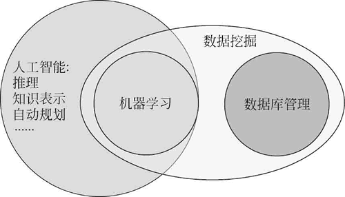
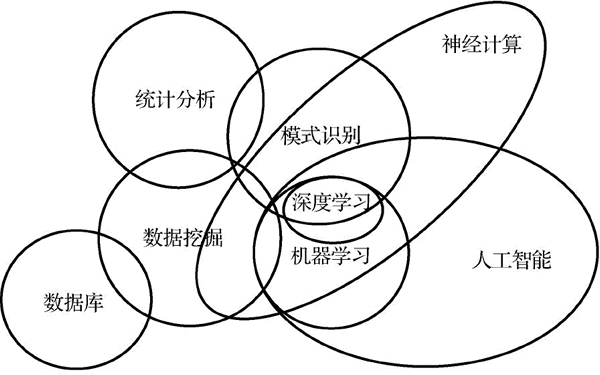
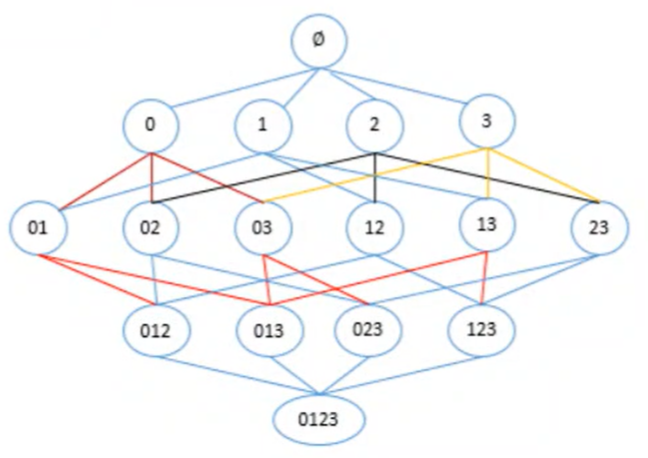
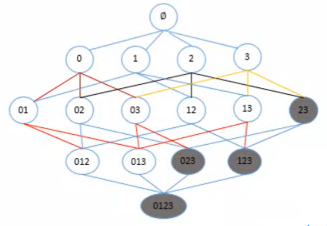
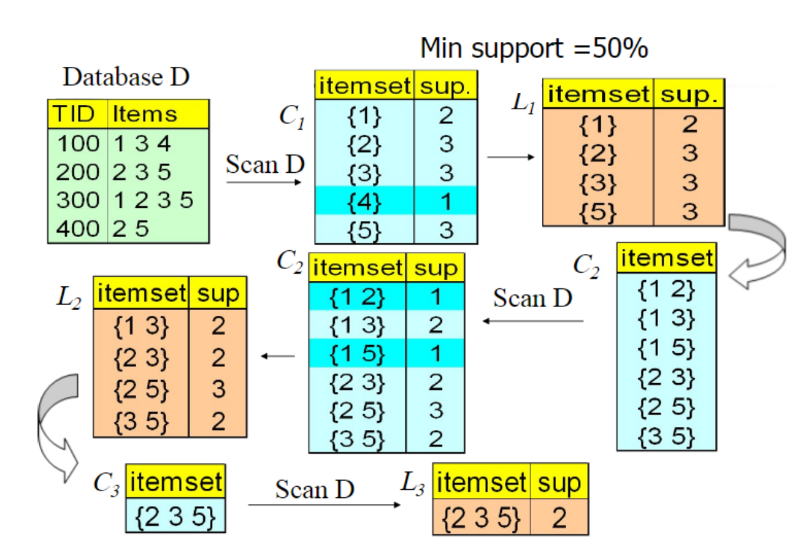

# 第八次作业

任课老师：蒲晓


## 作业内容
### 1. 数据挖掘、人工智能和机器学习的区别和联系
   
#### 1.1 三者的定义
* **机器学习：** 使用计算机作为工具并致力于真实实时的模拟人类学习方式，并将现有内容进行知识结构划分来有效提高学习效率，是一种能通过经验自动改进的计算机算法的研究。机器学习的典型运用包括图像识别、语音识别、流量预测、产品推荐等

* **人工智能：** 让机器的行为看起来像人所表现出的智能行为一样。人工智能的典型运用包括：博弈游戏、语音识别、机器翻译、计算机视觉系统、自然语言处理等

* **数据挖掘：** 使用机器学习、统计学和数据库等方法在相对大量的数据集中发现模式和知识，它涉及数据预处理、模型与推断、可视化等。数据挖掘的典型运用包括异常检测、关联分析、聚类、分类、回归等




#### 1.2 三者的区别
三者区别主要是目的不同，其手段（算法、模型）有很大的重叠，所以经常被混在一起。

①数据挖掘是用来理解事物的：有目的地从现有大数据中提取数据的模式(pattern)和模型(model)

②机器学习是用来预测事务的：自动地从过往的经验中学习新的知识，目前在实践中最重要的功能便是预测结果

③人工智能是用来生成行动的：一个广泛的概念，本质是用数据和模型去为现有的问题(existing problems)提供解决方法(solutions)

#### 1.3 三者的联系

①机器学习是人工智能的一个分支，作为人工智能的核心技术、实现手段和重要支撑技术，通过机器学习的方法解决人工智能面对的问题。

②数据挖掘和机器学习的关系越来越密切，数据挖掘的过程中会使用到很多机器学习的算法。

③数据挖掘提取的数据的模式和模型会被用在未来机器学习和人工智能的数据使用。



### 2. ~~简单~~叙述关联规则与Apriori算法

#### 2.1 引入与定义
在美国的有婴儿家庭中，通常是母亲在家中照看婴儿，父亲去超市为婴儿购买尿布。当丈夫在为孩子购买尿布的同时，也通常购买自己爱喝的啤酒。因此，沃尔玛超市在发现这一规律后，将啤酒和尿布放在相同的区域，使得父亲可以同时买到这两件商品，从而提高啤酒与尿布的销量。

日常中，在我们去超市进行购物的时候，也经常见到超市将某些商品捆绑在一起进行销售。然而，这些捆绑的依据是什么？超市又是如何发现这些规律的呢？

实际上，超市这种销售的行为并不是偶然的，而是长期从顾客的大量订单中分析，从而得出的结果。

**关联分析，就是从大规模数据中，发现对象之间隐含关系与规律的过程，也称为关联规则学习。** 例如，上述引入中的啤酒→尿布就是一个关联规则。

#### 2.2 应用场景
* 超市购物分析
* 图书购买分析
* 服装搭配分析
* 交通事故分析
* 疾病症状分析
* 社交关系分析

#### 2.3 相关概念
##### 2.3.1 项与项集
项，指我们分析数据中的每一个对象，而项集就是由若干项构成的集合。

例如，在下面的水果购物清单中：

|购物清单|
|---|
|苹果、香蕉、葡萄|
|苹果、桔子|
|苹果、火龙果|
|葡萄、桔子|
|葡萄、桔子、梨|
|葡萄、梨、火龙果|

苹果，香蕉等每一个水果对象，都是一个项；而一个或更多水果（项）构成的集合，就是项集。例如，{葡萄}，{香蕉、梨}都是项集。

##### 2.3.2  支持度

支持度为某项集在数据集中出现的频率，即项集在记录中出现的次数，除以数据集中所有记录的数量。

\[support(A) = \frac{{count(A)}}{{count(dataset)}} = P(A)\]

 支持度体现的是某项集的频繁程度，只有某项集的支持度达到一定程度，我们才有研究该项集的必要。

##### 2.3.3 置信度

关联规则（$A→B$）中，置信度为A与B同时出现的次数，除以A出现的次数。
\[confidence(A \to B) = \frac{{count(AB)}}{{count(A)}} = \frac{{\frac{{count(AB)}}{{count(dataset)}}}}{{\frac{{count(A)}}{{count(dataset)}}}} = \frac{{P(AB)}}{{P(A)}} = P(B|A)\]

置信度体现的是关联规则的可靠程度，如果关联规则（$A→B$）的置信度较高，则说明当A发生时，B也有很大概率也会发生，这样就可能会带来研究价值。

##### 2.3.4 提升度

关联规则($A→B$)中，提升度为($A→B$的置信度)，除以B的支持度。

\[lift(A \to B) = \frac{{confidence(A \to B)}}{{support(B)}} = \frac{{P(B|A)}}{{P(B)}} = \frac{{P(AB)}}{{P(A)P(B)}}\]

提升度体现的是组合（应用关联规则）相对不组合（不应用关联规则）的比值，如果提升度大于1，则说明应用该关联规则是有价值的。如果提升度小于1，说明应用该关联规则起到了负面影响。因此，我们应该尽可能让关联规则的提升度大于1，提升值越大，则应用该关联规则的效果越好。

##### 2.3.5 频繁项集

通常情况下，我们只会对频繁出现的项集进行研究。因此，我们会设置一个支持度阈值，如果一个项集的支持度达到（大于等于）该阀值，则该项集就称为频繁项集。特别的，如果频繁项集中含有$k$个元素，我们则称之为频繁$k$项集。

#### 2.4 关联分析过程

关联分析可分为如下两个过程：

1. 从数据集中寻找频繁项集
   
2. 从频繁项集中生成关联规则
   
#### 2.5 寻找频繁项集

首先，我们需要能够找到所有的频繁项集，即经常出现在一起的对象结合。实际上，找到频繁项集并不复杂，只需要按照如下的步骤来操作即可。

1. 遍历对象之间所有的可能的组合（包括单个对象的组合），每种组合构成一个项集。
2. 针对每一个项集A，计算A的支持度（A出现的次数除以记录总数）
3. 返回所有支持度大于指定阈值的项集。



但是，以上这种穷举法理论上正确，但是在大数据面前实际应用是举步维艰的，因此我们需要使用Apriori算法来寻找频繁项集。

##### 2.5.1 Apriori算法原理

对象之间任意组合构成的项集，数量可能非常大。例如，在上图中，4个不同的对象（项），就可以构成15种组合，而对于含有$N$个对象的数据集合，总共可以构成$2^N-1$种组合，这是一个非常大的数字。

因此，为了降低计算量，我们使用Apriori算法原理进行优化，Apriori算法可以解释如下：
1. 如果一个项集是频繁项集，则所有子集（非空）也是频繁项集。
2. 如果一个项集（非空）是非频繁项集，则所有父集也是非频繁项集。

Apriori算法会从$k=1$开始，使用两个$k$项集进行组合，从而产生$k+1$项集。结合之前介绍的算法原理，我们可知，频繁$k+1$项集是两个$k$项集合组合而成，而对于频繁$k+1$项集，其所有的$k$项子集必然都是频繁项集，这就意味着，频繁$k+1$项集只可能从两个频繁$k$项集组合产生，因此，当我们在组合的过程中，一旦发现某个$k$项集不是频繁项集（支持度小于指定阈值），就可以将其移除，而无需再参与后续生成$k+1$项集的组合。这样一来，就可以大大减少计算量。

例如在下图中，假设(2,3)是非频繁项集，则根据Apriori算法原理，其所有父集也是非频繁项集。故{0,2,3},{1,2,3}与{0,1,2,3}也是非频繁项集。因此，我们就无需使用{2，3}与其他2项集进行组合，去生成3项集了（因为生成的所有3项集都是非频繁项集）。



##### 2.5.2 Apriori算法流程

Apriori算法流程如下：

1. 扫描数据集，从数据集中生成候选$k$项集${C_k}$($k$从1开始)。
2. 计算${C_k}$中，每个项集的支持度，删除低于阈值的项集，构成频繁项集${L_k}$。
3. 将频繁项集${L_k}$中的元素进行组合，生成候选$k+1$项集${C_{k+1}}$。
4. 重复步骤2.3，直到满足以下两个条件之一时，算法结束：

* 频繁$k$项集无法组合生成候选$k+1$项集。
* 所有候选$k$项集支持度都低于指定的阈值（最小生成度），无法生成频繁$k$项集。
  
> 说明：
> ${C_k}$：所有的候选$k$项集
> ${L_k}$：所有的频繁$k$项集



#### 2.6 生成关联规则

当产生频繁项集后，生成关联规则会相对简单。我们只需要将每个频繁项集拆分成两个非空子集，然后使用这两个子集，就可以构成关联规则。当然，一个频繁项集拆分成两个非空子集可能又很多种方式，我们要考虑每一种不同的可能。例如，频繁项集{2，3，5}可以拆分为：

{2->3,5}

{3->2,5}

{5->2,3}

{3,5->2}

{2,5->3}

{2,3->5}

然后，我们针对每一个关联规则，分别计算其置信度，仅保留符合最小置信度的关连规则。

**总结：考虑支持度->考虑置信度->(考虑提升度)**

#### 2.7 程序实现
#### 2.7.1 加载数据集
**数据来源：** [kaggle(Market Basket Optimisation)](https://www.kaggle.com/datasets/d4rklucif3r/market-basket-optimisation)


首先，我们需要从文件中读取数据。

```python
def load_data(path):  # 文件所在的路径
    content=[]        # 用来存放处理后的内容
    with open(path,encoding="UTF-8") as f:
        for line in f:
            line=line.strip("\n")
            content.append(line.split(","))
    return content
```

```python
dataset=load_data("data.txt")# dataset是二维列表，每个元素是一个一维列表，保存着每个购物清单的商品记录
print(len(dataset))
```

然后，我们来浏览数据的大致形式。由于记录较多，我们这里仅查看前10条记录（订单）。

```python
# print(dataset[:10])  #太丑了
for i in range(10):
        print(i + 1, dataset[i], sep=",")
```

#### 2.7.2 调库Apriori算法

我们可以通过Apriori算法来发现关联规则，efficient-apioriori模块为我们提供了该算法的实现。此模块不是Pycharm自带模块，我们需要自行安装，使用如下命令：`pip install efficient-apriori`

```python
from efficient-apriori import apriori
# transactions：交易数据，要求为二位数据结构，每个维度用来存放每个购物清单的商品。
# min_support:最小支持度
# min_confidence:最小置信度
itemsets,rules=apriori(transaction=dataset,min_support=0.05,min_confidence=0.3)  # apriori函数回返回满足条件的频繁项集
print(itemsets)  # 输出所有满足条件频繁k项集
print(rules)  # 输出关联规则
```

apriori函数返回的关联规则列表，每个元素为efficient_apriori.rules.Rule类型，我们可以输出这些对象，能看到更加详细的信息：

* 支持度
* 置信度
* 提升度
* 确信度

其中，给定关联规则$(A→B)$,确信度的计算方式为：
\[convicition(A \to B) = \frac{{1 - support(B)}}{{1 - confidence(A \to B)}} = \frac{{P(\tilde B)}}{{P(\tilde B|A)}}\]

如果一个关联规则的确信度大，则表示该规则的置信度较大，并且$B$经常出现。

```python
for r in rules:
    print(r)
```

此外，我们还可以通过Rule类提供的属性，来获取对应的信息值。
```python
r=rules[0]
print("支持度",r.support)
print("置信度",r.confidence)
print("提升度",r.lift)
print("确信度",r.conviction)
```

#### 2.7.3 手写Apriori算法
##### 2.7.3.1 加载数据集
同2.7.1，不再赘述

##### 2.7.3.2 编码转换
数据集中含有的文本数据，虽然也能够操作，但会影响性能，也将带来一定的繁琐，为了方便起见，我们对文本进行编码，将其转换为数值类型。

```python
import itertools
items=set(itertools.chain(*dataset))   #二维列表扁平化
str_to_index={} # 用来保存字符串到编码的映射
index_to_str={} # 用来保存编码到字符串的映射

for index,item in enumerate(items):
    str_to_index[item]=index
    index_to_str[index]=item

# 输出结果
for item in list(str_to_index.items())[:5]:
    print(item)
for item in list(index_to_str.items())[:5]:
    print(item)
```

我们将原始数据进行转换，由字符串映射为数值索引。

```python
for i in range(len(dataset)):
    for j in range(len(dataset)):
        dataset[i][j]=str_to_index[dataset[i][j]]
for i in range(10):  # 输出结果
    print(i+1,dataset[i],sep="->")
```

##### 2.7.3.3 生成候选1项集列表

接下来，我们来扫描加载后的数据集，生成候选1项集列表。因为候选1项集列表是从原始数据集中生成的，因此，列表中的每个元素就是数据集中不重复的对象。为了方便后面的操作，我们把每个对象放入frozenset中。**将每个对象放入frozenset而不是放入set里面主要是为了将元素作为字典的key，set作为可变变量其为不可哈希的，作为字典的key必须是可哈希的。**

```python
def buildC1(dataset):
    item1=set(itertools.chain(*dataset))
    return [frozenset([i]) for i in item1]

c1=buildC1(dataset)
```

##### 2.7.3.4 根据候选1项集生成频繁1项集

当生成候选1集列表后，我们就可以根据候选1集合列表，生成频繁1项集字典，字典中的key为frozenset类型的对象，该key对象是我们要分析的项集，字典的value为每个项集对应的支持度。

```python
def ck_to_lk(dataset,ck,min_support):
    support=[]   # 定义项集-频数字典，用来存储每个项集(key)与其对应的频数(value)
    for row in dataset:
        for item in ck:
            if item.issubset(row):  #判断项集是否在记录（行）中出现
                support[item]=support.get(item,0)+1
    total=len(dataset)
    return {k:v/total for k,v in support items() if v/ total >= min support}

L1=ck_to_lk(dataset,c1,0.05)
```
##### 2.7.3.5 频繁k项集组合成候选k+1项集

当产生频繁k项集后，我们需要对频繁k项集中的元素进行组合，如果组合后的项集数量为k+1，则保留此种组合，否则，丢弃此种组合。

```python
def lk_to_ck(lk_list):
    ck=set()  # 保存所有组合之后的候选k+1项集
    lk_size=len(lk_list)
    if lk_size>1:  # 如果频率k项集的数量小于1，则不可能通过组合生成k+1项集，直接返回空set即可
        k=len(lk_list[0])  #获取频繁k项集的k值
        for i,j in itertools.combinations(range(lk_size),2):
            t= lk_list[i] | lk_list[j]    #将对应位置的两个频繁k项集进行组合，生成一个新的项集
            if len(t)==k+1: #如果组合之后的项集是k+1项集，则为候选k+1项集，加入结果到set中
                ck.add(t)
    return ck

c2=lk_to_ck(list(L1.keys()))
```

生成候选2项集后，我们继续调用`ck_to_lk`函数，生成频繁2项集，如此进行，直到不能再产生项集为止

```python
c2=ck_to_lk(dataset,c2,0.05)
```

##### 2.7.3.6 生成所有频繁项集

我们可以定义一个函数，将之前的步骤进行组合，从而能够从原始数据集中，生成所有的频繁项集。

```python
def get_L_all(dataset,min_support):
    c1=buildC1(dataset)
    L1=ck_to_lk(dataset,c1,min_support)

    L_all=L1 # 定义字典，保存所有的频繁k项集
    Lk=L1
    while len(Lk)>1: # 当频繁项集中的元素（键值对）大于1时，才有可能组合生成候选k+1项集
        lk_key_list=list(Lk.keys())
        ck=lk_to_ck(lk_key_list)  # 由频繁k项集生成候选k+1项集
        Lk=ck_to_lk(dataset,ck,min_support) # 由候选k+1项集生成频繁k+1项集
        if len(Lk)>0:  # 如果频繁k+1项集字典不为空，则将所有频繁k+1项集加入到L_all字典中
            L_all=all.update(Lk)
        else:
            break # 否则，频繁k+1项集为空，退出循环
    return L_all

L_all=get_L_all(dataset,0.05)
```
##### 2.7.3.7 生成关联规则

编写一个函数，用于从一个频繁项集中，生成关联规则。
```python
def rules_from_item(item):
    left=[]  #定义规则左侧的列表
    for i in range(1,len(item)):
        left.extend(itertools.combinations(item,1))
    return [(frozenset(le),frozenset(item.difference(le))) for le in left]

rules_from_item(frozenset({1,2,3}))
```

当生成包含所有频繁k项集的字典后，我们就可以遍历字典中的每一个键（频繁项集），进而计算该频繁项集的所有可能的关联规则，然后对每一个可能的关联规则，计算置信度，保留符合最小置信度的关联规则。

```python
def rules_from_L_all(L_all,min_confidence):
    rules=[]   #保存所有候选的关联规则
    for Lk in L_all:
        #如果频繁项集的元素个数为1，则无法生成关联规则，不予考虑
        if len(Lk)>1:
            rules.extend(rules_from_item(Lk))
    result=[]
    for left,right in rules:
        support=L_all[left|right]
        confidence=support/L_all[left]
        lift=confidence>=min_confidence
        if confidence>min_confidence:
            result.append({"左侧"：left,"右侧":right,"支持度":support,"置信度":confidence,"提升度":lift})
    return result

rules_from_L_all(L_all,0.3)
```
##### 2.7.3.8 最终程序

将之前的程序进行合并，写成最终一个函数，能够从原始数据集中，生成关联规则。

```python
def apriori(dataset,min_support,min_confidence):
    L_all=get_L_all(dataset,min_support)
    rules=rules_from_L_all(L_all,min_confidence)
    return rules

rules=apriori(dataset,0.05,0.3)
```

最后，我们将代码转换为真实的对象名称，同时，为了能够清晰呈现数据，我们使用DataFrame对象来进行展示。
```python
import pandas as pd

def change(item):
    li=list(item)
    for i in range(len(li)):
        li[i]=index_to_str[li[i]]
    return li

df=pd.DataFrame(rules)
df=df.reindex("左侧","右侧","支持度","置信度","提升度",axis=1)
df["左侧"]=df["左侧"].apply(change)
df["右侧"]=df["右侧"].apply(change)
```

## 作业反思
1. 可以进一步学习FP-tree和FP-growth算法
2. 